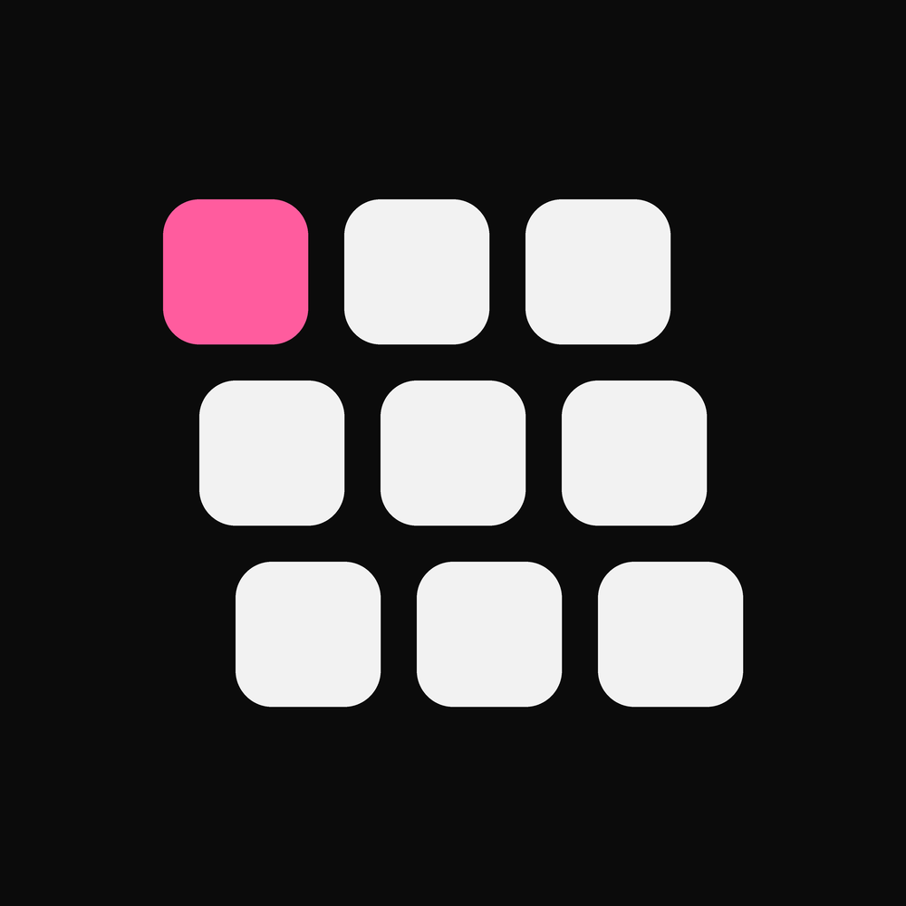
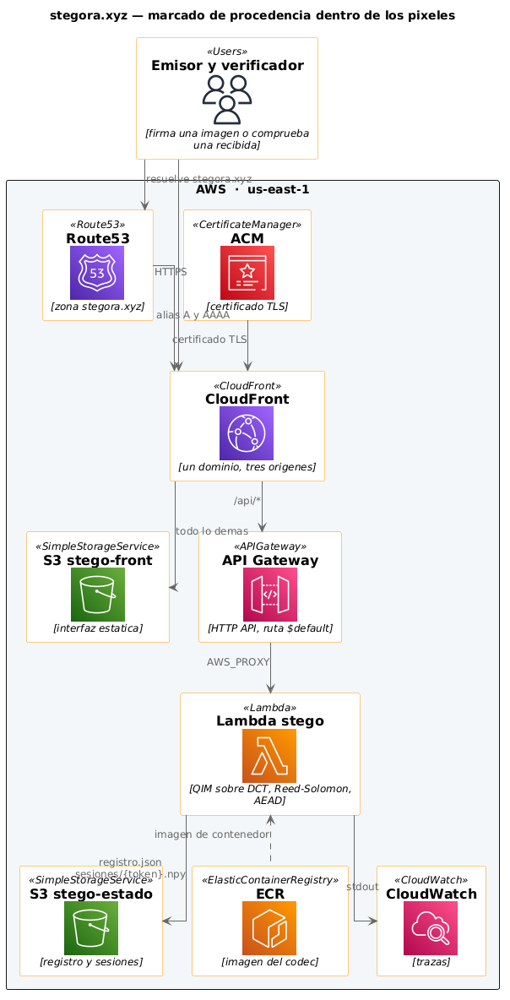

# Stegora — team-12 · Platanus Hack 26: Bogotá



Track: 🛡️ AI Security

- **Demo en vivo:** <https://stegora.xyz/>
- **Repositorio:** <https://github.com/platanus-hack/platanus-hack-26-co-team-12>

Marca de procedencia que vive **dentro de los píxeles**. El emisor firma una
imagen y recibe un archivo visualmente idéntico (PSNR 39.27 dB); después, aunque
la imagen llegue recortada, reescalada, recomprimida o reenviada por WhatsApp, el
identificador de 16 bytes se recupera exacto. Es un **registro, no un detector**:
devuelve «identificador recuperado» o «sin marca legible», nunca una acusación.

En la práctica son dos gestos. **Firmar**: el emisor sube una imagen y pone su
nombre, opcionalmente un título y un enlace; recibe de vuelta el archivo marcado
y queda un asiento en el registro. **Verificar**: cualquiera sube una imagen y
obtiene ese asiento —quién la firmó, cuándo, con qué título— o un «sin marca
legible». La demo añade un banco de ataques: sobre la imagen que acabas de
firmar aplica recorte, reescalado, recompresión JPEG y el reenvío por WhatsApp,
y enseña qué sobrevive a cada uno.

La otra limitación, declarada: **el nombre del emisor no se autentica**.
Cualquiera puede escribir cualquier nombre. Lo que el sistema garantiza es que
la marca recuperada es exactamente la que se puso, y que sin la passphrase nadie
puede fabricar una válida. Acreditar quién es quién es un problema de identidad,
aparte, y no lo resuelve esto.

Responde al Artículo 50 del AI Act, donde el marcado por metadatos (C2PA) se
destruye en el primer reenvío.

La marca vive en las **frecuencias**, no en los bits sueltos: es lo que un
compresor con pérdida tiene que respetar, y por eso el mismo mecanismo traslada a
audio y video. Hoy solo la rama de imagen está medida y es la que se demuestra;
la rama de audio del repo es anterior y la auditoría interna la dejó marcada como
no válida (`docs/auditoria.md`).

## Cómo funciona

El identificador no se escribe *sobre* la imagen: se reparte por dentro de ella.

1. **Se prepara el mensaje.** Los 16 bytes se comprimen, se cifran con la
   passphrase y se les añade información de repuesto — el mismo truco que hace
   que un CD rayado siga sonando: sobra material para reconstruir lo perdido.
2. **Se esconde en las frecuencias.** En vez de tocar píxeles sueltos, se altera
   levemente el patrón de luces y sombras de la imagen. Son las estructuras que
   JPEG o WhatsApp están obligados a conservar para que la foto siga pareciendo
   esa foto, y por eso la marca sobrevive a la compresión.
3. **Se repite en mosaico.** El patrón se repite cada 128 px por toda la imagen,
   así que un recorte se lleva unas copias pero nunca todas.
4. **Al verificar, se busca a ciegas.** No hace falta la imagen original, ni
   metadatos, ni un archivo aparte: solo la passphrase. O aparece el
   identificador, o no aparece.

El detalle técnico —Argon2id, ChaCha20-Poly1305, Reed–Solomon, QIM sobre DCT—
está en [docs/arquitectura.md](docs/arquitectura.md).

## Resultados

30 intentos por ataque (3 fotografías × 10 firmas), `web/tasas.json`:

| Ataque | Recuperación |
|---|---|
| Limpia · JPEG Q75 · recorte 800 px · escala ×0.75 · WhatsApp · recorte+WhatsApp | 100 % |
| Recorte a 400 px · recorte a 256 px | 97 % |

Falsos positivos con passphrase incorrecta: 0. Límites declarados: rotación no
soportada, JPEG Q20 fuera de alcance, recorte mínimo ~256 px marcando a 1024 px.

## Correr local

```bash
scripts/install.sh
.venv/bin/python -m uvicorn web.server:app --port 8000   # http://localhost:8000
```

O con Docker: `docker compose up` → front en <http://localhost:8080> y API en
<http://localhost:8000>.

## Despliegue

La infraestructura está definida con **Terraform**: CloudFront sirve el front
desde S3 y la API corre en una Lambda detrás de API Gateway. El despliegue se
lanza con `scripts/deploy.sh`.



## Mapa del repo

| Ruta | Qué hay |
|---|---|
| `src/stego/` | Códec: DCT+QIM, ChaCha20-Poly1305, Reed–Solomon, batería de ataques |
| `web/` | Demo: FastAPI + HTML/CSS/JS plano, sin build step |
| `benchmarks/`, `docs/resultados.md` | Medición y metodología |
| `terraform/`, `scripts/deploy.sh` | Infra en AWS (CloudFront + S3 + Lambda) definida con Terraform |
| `deck/` | Deck de la presentación |
| `PRODUCT.md`, `DESIGN.md` | Decisiones de producto y de interfaz |

## Equipo

- Daniel Andrés Moreno Cruz ([@alinedmooner](https://github.com/alinedmooner))
- Brayan Elian Peña Jaimes ([@darkelian](https://github.com/darkelian))
- Carlos Mora ([@fozzy3](https://github.com/fozzy3))
- Brayan Alejandro Riveros ([@brayan-22](https://github.com/brayan-22))
- Cristian Stiven Guzman Tovar ([@cristiangt089](https://github.com/cristiangt089))

## Licencia

GPL-3.0 — ver [LICENSE](LICENSE).
